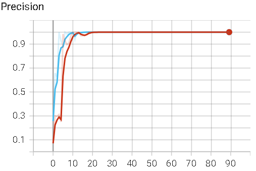
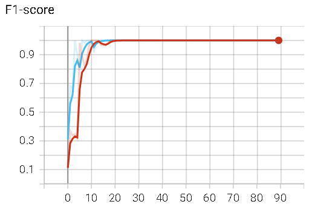
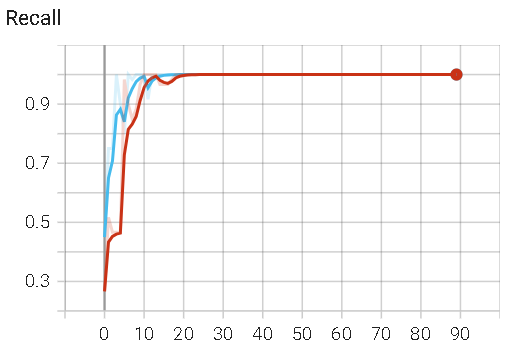

# 数字音视频分析课程实验报告（一）
## 基本信息

- **班级：** 人工智能2103班
- **姓名：** 金家耀
- **学号：** 1193210320
- **教师：** 王锐
- **地点：** 人工智能与计算机学院 B302

## 一、实验内容
1. 给定的 dataset 中包含了 4 个手势类别，每个类别由 100 张 RGB 图片组成；
2. 各位同学首先需要将所有的 RGB 图片转换成 HSV 类型，然后从中提取亮度（灰度）信息；接着，对上述灰度图像施加直方图均衡化操作，以期降低图片中的光照因素对后续分类结果的影响；
3. 对于上述多分类问题（4 类），请同学们自行选择一种机器学习算法，如 Linear Discriminant Analysis (LDA)、Kernel Discriminant Analysis (KDA)、Sparse Representation (SR)、Dictionary Learning (DL)等，并结合简单的分类器（K 近邻、支持向量机等）对 2）中处理后的数据进行训练和测试。此外，也可选用简单的神经网络模型。
4. 编程语言不限：MATLAB、Python、C 等均可以。

## 二、数据集部分展示

  
  
<strong>图2.1 四种手势数据集</strong>

&emsp;&emsp;数据集中包含四种类型的手势图片：左偏、剪刀手、分指、和右偏手势。每张手势图片的尺寸均为320x240，并且拍摄质量非常清晰。值得注意的是，观察每种手势图片时，可以注意到每张图像的手势角度略有变化，但总体上噪声较少。（然而，为了提高机器学习和神经网络模型的性能，可能需要引入一些具有噪声的图像样本。）

## 三、图像预处理
### RGB转HSV并提取亮度（灰度）信息

  
  
<strong>图3.1 图像预处理过程</strong>

想要提取一张图片的亮度信息，则先要将RGB转化成HSV并提取V维度的数值，RGB转成HSV的过程公式如下：
1. 将RGB颜色值标准化到[0, 1]范围内，即将每个颜色通道的值除以255（最大颜色通道值）：

$$
\begin{aligned}
   R' = R / 255\\
   G' = G / 255\\
   B' = B / 255
\end{aligned}
$$

2. 计算最大通道和最小通道的值，以确定色相（H）：

$$
\begin{aligned}
   &C_{max} = max(R', G', B')\\
   &C_{min} = min(R', G', B')\\
   &\Delta=C_{max}-C_{min}
\end{aligned}
$$

3. 计算色相（H）：

$$ H=\left\{
\begin{aligned}
&0^\circ & & \Delta=0 \\
&60^\circ \cdot (\frac{G^{'}-B^{'}}{\Delta}+0) & & C_{max}=R^{'} \\
&60^\circ \cdot (\frac{B^{'}-R^{'}}{\Delta}+2) & & C_{max}=G^{'} \\
&60^\circ \cdot (\frac{R^{'}-G^{'}}{\Delta}+4) & & C_{max}=B^{'} \\
\end{aligned}
\right.
$$

4. 计算饱和度（S）：

$$ S=\left\{
\begin{aligned}
&0 & & C_{max}=0 \\
&\frac{\Delta}{C_{max}}& & otherwise \\
\end{aligned}
\right.
$$

5. 计算亮度（V）：

$$
\begin{aligned}
   V = Cmax
\end{aligned}
$$

  
  
<strong>图3.2 RGB原图及HSV三通道展示图</strong>

如图3.2为一张手势RGB原图以及HSV三通道展示图。

### 直方图均衡化
&emsp;&emsp;给定一个输入图像 $I(x, y)$，其中 $(x, y)$ 表示图像的像素坐标，以及 L 为像素灰度级别的总数（通常为 256，对应于8位图像），直方图均衡化可以通过以下步骤来实现：

1. 计算输入图像的直方图：$H(i) = n_i / N$，其中 $H(i)$ 是像素值 i 的频率分布，$n_i$ 是图像中像素值为 i 的像素数量，$N$ 是图像总像素数量。

2. 计算累积分布函数（CDF）：$C(i) = \sum_{j=0}^{i} H(j)$，其中 $C(i)$ 是像素值 i 的累积分布函数。

3. 将CDF线性拉伸到0到L-1的范围内：$S(i) = \frac{C(i) - C_{\text{min}}}{{1 - C_{\text{min}}}} \cdot (L - 1)$，其中 $C_{\text{min}}$ 是CDF的最小非零值。

4. 使用新的像素值替换原始图像中的每个像素：$I_{\text{equalized}}(x, y) = S(I(x, y))$，其中 $I_{\text{equalized}}(x, y)$ 是均衡化后的图像，$I(x, y)$ 是原始图像。

  
  
<strong>图3.3 直方图均衡化</strong>

&emsp;&emsp;通过这个过程，图像的对比度得以显著增强，更广泛的亮度级别被有效利用，从而显著提升了图像的视觉质量。如图3.2所示，这是使用数据集中的第一张手势图进行的直方图均衡化后的直方图。从直方图的对比度明显提升的图示中，可以清晰地观察到，均衡化后的图像像素范围更加广泛。这有助于将原始图像中紧密聚集的像素值分散开，为后续的机器学习算法和神经网络提供更好的输入数据。

## 四、模型选择——机器学习
### 4.1 介绍
#### 4.1.1 LDA算法
> LDA的全称是Linear Discriminant Analysis（线性判别分析），是一种supervised learning。有些资料上也称为是Fisher’s Linear Discriminant，因为它被Ronald Fisher发明自1936年。LDA是在目前机器学习、数据挖掘领域经典且热门的一个算法，据我所知，百度的商务搜索部里面就用了不少这方面的算法。

#### 1. 二分类LDA算法

&emsp;&emsp;假设数据集 $D=\{(x_1,y_1),(x_2,y_2),...,(x_n,y_n)\}$，现在假设是二分类问题，则 $y_i\in\{0,1\}$。假设第一类样本个数为 $N_1$，第二类样本个数为 $N_2$。定义 $\mu^j$为第j类样本的均值，$\Sigma^j$为第j类样本的方差。计算公式如下：
$$
  \left\{
    \begin{aligned}
    &\mu^j=\frac{1}{N_j} \Sigma_{x\in X_j}x\\
    &\Sigma^j=\sum_{x\in X_j}(x-\mu^j)(x-\mu^j)^T
    \end{aligned}
  \right.
$$

&emsp;&emsp;据我个人理解，分类的好坏在于类间散度和类内散度，所以我们最终需要使得类间散度与类内散度的比值越大越好。现假设我们的投影直线为向量 $\omega$，则对于任意一个样本 $x_i$，它在直线 $\omega$上的投影为 $\omega^T x_i$，则对于两类均值$\mu^j$，其在直线上的投影为 $\omega^T\mu^j$，则方差为 $\omega^T\Sigma^j\omega$，最终我们得到目标函数：

$$argmax_{\{\omega\}}J(\omega)=\frac{||\omega^T\mu^0-\omega^T\mu^1||^2_2}{\omega^T\Sigma^0\omega+\omega^T\Sigma^1\omega}=\frac{\omega^T(\mu^0-\mu^1)(\mu^0-\mu^1)^T\omega}{\omega^T(\Sigma^0+\Sigma^1)\omega}$$

令 $S_b=(\mu^0-\mu^1)(\mu^0-\mu^1)^T$，$S_w=\Sigma^0+\Sigma^1$，则公式变为：
$$argmax_{\{\omega\}}J(\omega)=\frac{\omega^TS_b\omega}{\omega^TS_w\omega}$$

&emsp;&emsp;根据瑞利商公式，$J(\omega^*)$ 的最大值为 $S_w^{-\frac 12}S_bS_w^{-\frac 12}$ 的最大特征值，而 $\omega^*$ 为该特征值对应的特征向量。

#### 2. 多分类LDA算法
&emsp;&emsp;由于该实验做的是四分类问题，所以需要进一步搞清楚多分类LDA算法的计算过程。同样地，假设数据集 $D=\{(x_1,y_1),(x_2,y_2),...,(x_n,y_n)\}$，则 $y_i\in\{1,2,...,k\}$，其中 $k$ 为样本类别个数。每个类别的样本个数、样本均值、样本方差与二分类LDA算法一致。

由于该问题是多分类问题，所以投影的不再是一条直线，而是一个超平面 $W$，设该超平面的维度为 $d$，其基向量为 $(\omega_1, \omega_2, ..., \omega_d)$。

&emsp;&emsp;由二分类问题推广，我们的目标函数变为：
$$argmax_{\{W\}}J(W)=\frac{W^TS_bW}{W^TS_wW}$$
其中，$S_b=\sum_{j=1}^d(\mu^j-\mu)(\mu^j-\mu)^T$，$\mu$为所有样本的均值， $S_w=\sum_{j=1}^k\Sigma^j$。

&emsp;&emsp;由于目标函数是一个矩阵优化问题，故无法从二分类问题中推广，则这里会有个小小的目标函数的松弛（个人觉得很精辟）：
$$argmax_{\{W\}}J(W)=\frac{\Pi_{diag} W^TS_bW}{\Pi_{diag}W^TS_wW}=\frac{\Pi_{i=1}^{d}\omega_i^TS_w\omega_i}{\Pi_{i=1}^{d}\omega_i^TS_b\omega_i}=\Pi_{i=1}^{d}\frac{\omega_i^TS_w\omega_i}{\omega_i^TS_b\omega_i}$$

&emsp;&emsp;可以观察，化简最后的式子其实也是广义瑞利熵，最终的 $W^*$其实就是 $S_w^{-\frac 12}S_bS_w^{-\frac 12}$ 的最大 $d$个特征根所对应的特征向量。

#### 4.1.2 SVM

### 4.2 训练与测试

  <table style="width: 80%;">
    <tr>
      <td></td>
      <td></td>
    </tr>
    <tr>
      <td></td>
      <td></td>
    </tr>
    <tr>
      <td></td>
      <td></td>
    </tr>
  </table>
  
<strong>图3.1 四种数据在LDA映射下的样本分布以及六个决策平面</strong>

## 五、模型选择——神经网络
### 介绍
### 训练

  
  
<strong>图4.1 模型训练预测结果</strong>

  <table style="width: 80%;">
    <tr>
      <td></td>
      <td></td>
    </tr>
    <tr>
      <td></td>
      <td></td>
    </tr>
  </table>
  
<strong>图4.2 原始输入与预处理输入对模型训练的影响</strong>

### 测试

## 七、思考、总结与拓展

### 为什么实验中不使用灰度图而是使用HSV的V通量？
$$
\begin{aligned}
Gray = 0.299 \cdot R + 0.587 \cdot G + 0.114 \cdot B 
\end{aligned} 
$$

RGB转成的V通道（亮度通道）和直接由RGB转成的灰度图之间有一些区别：

- 计算方式：
  - V通道：V通道是通过将RGB图像转换为HSV色彩空间，然后提取亮度通道得到的。HSV转换考虑了颜色信息和亮度信息，因此V通道的值受到颜色信息的影响。
  - 灰度图：直接由RGB图像转换为灰度图像是一种常见的方法，通常使用加权平均法将三个通道的值合并为一个灰度值。这种方法忽略了颜色信息，仅考虑亮度。

- 信息保留：
  - V通道：保留了原始RGB图像的颜色信息，但更强调亮度。这意味着V通道可以包含一些颜色变化的信息。
  - 灰度图：只保留了亮度信息，完全忽略了颜色信息。这意味着灰度图中不包含颜色信息。

- 亮度强调：
  - V通道：V通道的值受到颜色信息的影响，因此在存在颜色变化的区域，V通道的亮度可能会有所不同。
  - 灰度图：灰度图是根据亮度计算得出的，不考虑颜色。因此，即使存在颜色变化，灰度图中的亮度也会保持一致。

- 用途：
  - V通道：通常用于颜色图像处理中的一些任务，其中需要同时考虑颜色和亮度信息，例如图像分割、对象检测等。
  - 灰度图：通常用于需要仅考虑亮度而不考虑颜色的任务，例如边缘检测、图像压缩等。

总的来说，V通道和灰度图都有其特定的用途，具体取决于您的任务需求。如果需要保留颜色信息并考虑亮度，V通道可能更适合；如果只关注亮度，那么灰度图可能更合适。

